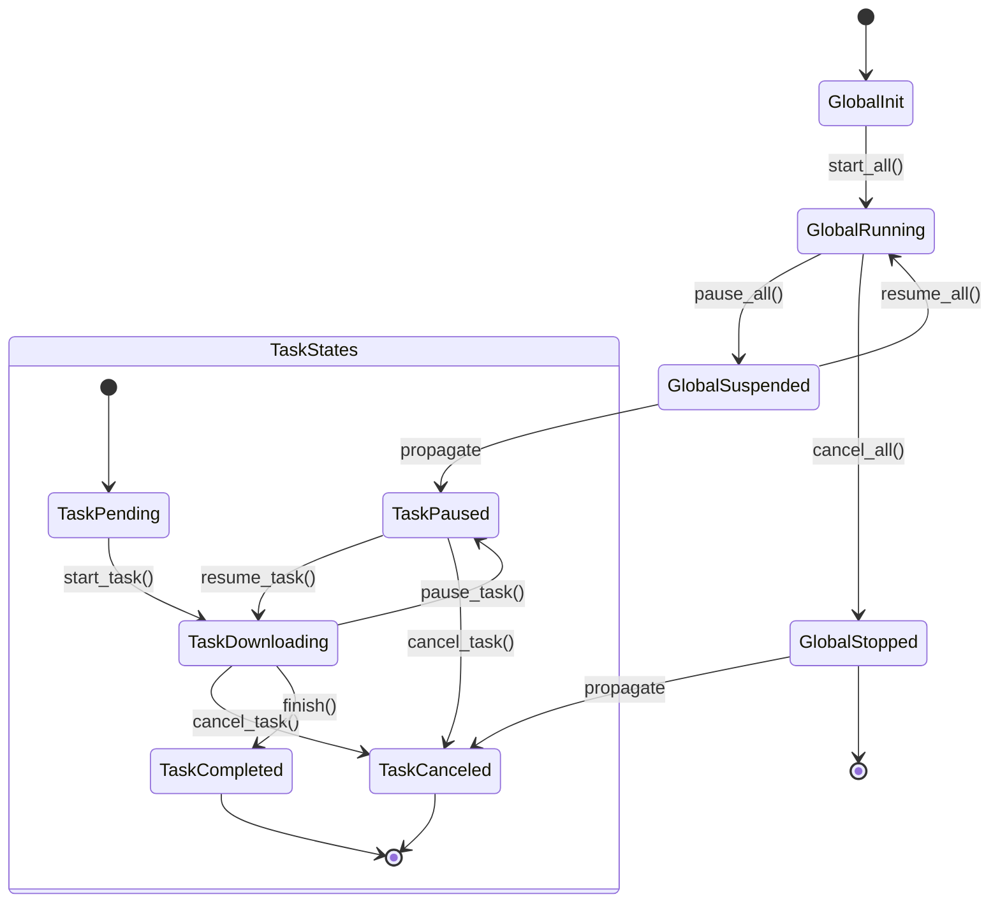

# 流程控制

`vielpork`提供了完整的流程控制方法，以便于您在编写异步代码时更加方便地控制流程。

- 全局控制
  - `downloader.lock().await.start(resources).await?;`
  - `downloader.lock().await.pause().await?;`
  - `downloader.lock().await.resume().await?;`
  - `downloader.lock().await.cancel().await?;`

- 任务控制
  - `downloader.lock().await.pause_task(resource).await?;`
  - `downloader.lock().await.resume_task(resource).await?;`
  - `downloader.lock().await.cancel_task(resource).await?;`

直接在代码中使用即可，`vielpork`会自动处理任务的状态转换。

## 状态转移图



## 合理的状态转换

`vielpork`的状态转换是有限状态机的形式，每个任务都有一个状态，每个任务的状态转换都是有限的。这样可以保证任务的状态转换是合理的，不会出现不合理的状态转换。

### 合理全局状态转换

```rust
let valid = match (*current, new_state) {
    (DownloaderState::Idle, DownloaderState::Idle) => true,
    (DownloaderState::Idle, DownloaderState::Running) => true,
    (DownloaderState::Running, DownloaderState::Suspended) => true,
    (DownloaderState::Suspended, DownloaderState::Running) => true,
    (DownloaderState::Stopped, DownloaderState::Idle) => true,
    (_, DownloaderState::Stopped) => true,
    _ => false,
};
```

### 合理任务状态转换

```rust
let valid = match (*current, new_state) {
    (TaskState::Paused, TaskState::Downloading) => true,
    (TaskState::Paused, TaskState::Paused) => true,
    (TaskState::Paused, TaskState::Pending) => true,
    (TaskState::Pending, TaskState::Paused) => true,
    (TaskState::Pending, TaskState::Downloading) => true,
    (TaskState::Downloading, TaskState::Paused) => true,
    (TaskState::Downloading, TaskState::Completed) => true,
    (TaskState::Failed, _) => true,
    (_, TaskState::Failed) => true,
    (_, TaskState::Canceled) => true,
    _ => false,
};
```
