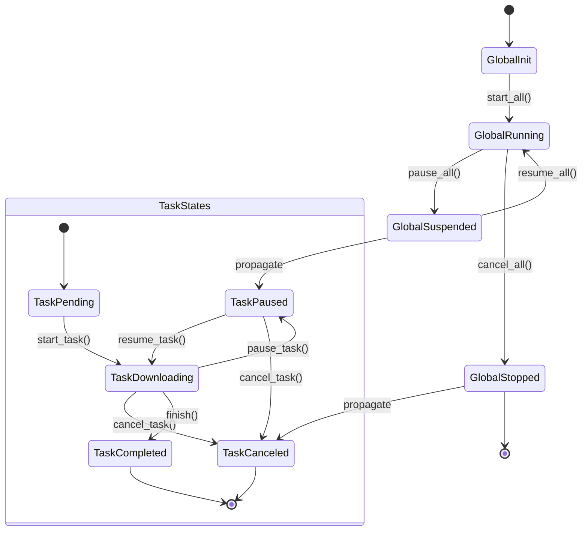

# 简介

Vielpork是一个高性能的多线程HTTP下载器，由Rust编写,具有可自定义的报告器和资源解析策略。它提供：

- 🚀 多线程下载以获得最大速度
- 📊 多种内置报告器适配大部分场景
- 📦 丰富的路径策略选项与模板命名支持
- 🔧 为不同下载场景提供可定制的资源解析策略
- ⏯️ 支持全局与单个任务的暂停/恢复功能

## 相关项目

- [osynic_downloader](https://crates.io/crates/osynic_downloader): 基于vielpork的osu!谱面下载器，包含工具库和TUI应用

## 核心特性

- **多线程架构**：利用Rust的异步运行时进行并发的分块下载
- **可扩展的报告系统**：
  - 内置报告器：TUI进度条，CLI广播mpsc通道
  - 通过trait实现自定义报告器
- **智能解析**：
  - 通过Resolver trait进行自定义解析逻辑
- **恢复与韧性**：
  - 继续上次中断的下载
- **进度跟踪**：
  - 实时速度计算
  - ETA估算
  - 详细的传输统计

## 内置选项

### 报告器

- **TuiReporter**：基于`indicatif`库的终端进度条
- **CliReporterBoardcastMpsc**：一个广播进度更新到多个通道并用单个通道完成的报告器（使用示例：在Tonic gRPC服务器流中，rx类型只能是mpsc，因此我们需要将进度广播到mpsc通道，然后通过服务器将其发送到客户端）

### 解析器

- **UrlResolver**：一个从URL下载资源的解析器，只是reqwest的简单包装

## 自定义组件

您可以在`vielpork::base::traits`中查看所有trait并实现自己的组件。

### 自定义报告器

- 这里有2个需要使用async_trait实现的trait：
  - `ProgressReporter`：允许报告器处理进度更新的trait
  - `ResultReporter`：允许报告器处理操作或任务的结果的trait

### 自定义解析器

- 这里只有1个需要使用async_trait实现的trait：
  - `ResourceResolver`：允许解析器从特定来源下载资源的trait

## 后记（或者说最开始的序章）

最开始找到了viel这个词，后面想了下rufen、ekstase、reichen

但是正在我还在犹豫不决的时候，好朋友来寝室送了我一纸杯的熏猪肉丝

所以我就直接取名叫做vielpork了，这个名字的意思是很多猪肉丝

但如果是功能描述的话，这个下载器主打的是多报道通道下载，所以也是很多报道

report的vielpork很接近，也还不错

对于连续吃了一个星期免费粥的我来说，这个名字已经很好了

哦对了，水煮肉片也可以算是VielPork了
