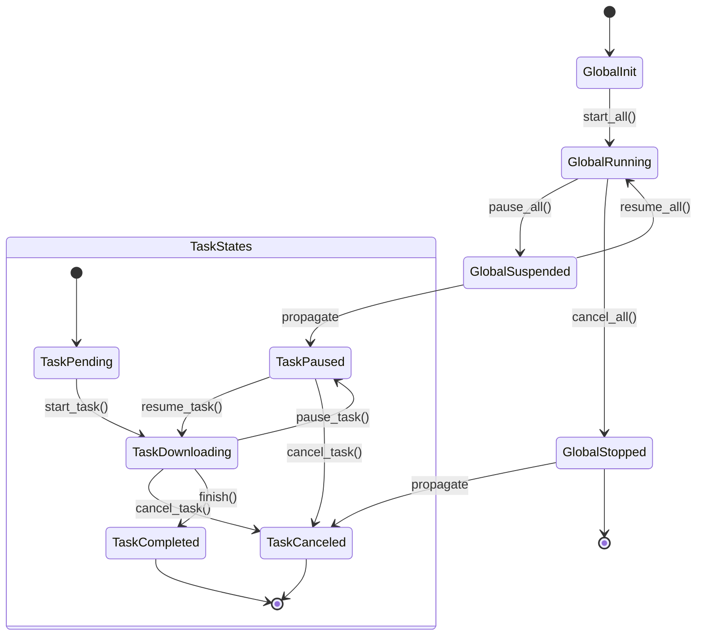

# Appendix

## State Diagrams

```mermaid
stateDiagram-v2
    [*] --> GlobalInit
    GlobalInit --> GlobalRunning: start_all()
    GlobalRunning --> GlobalSuspended: pause_all()
    GlobalSuspended --> GlobalRunning: resume_all()
    GlobalRunning --> GlobalStopped: cancel_all()
    GlobalStopped --> [*]
    
    state TaskStates {
        [*] --> TaskPending
        TaskPending --> TaskDownloading: start_task()
        TaskDownloading --> TaskPaused: pause_task()
        TaskPaused --> TaskDownloading: resume_task()
        TaskDownloading --> TaskCanceled: cancel_task()
        TaskDownloading --> TaskCompleted: finish()
        TaskPaused --> TaskCanceled: cancel_task()
        TaskCanceled --> [*]
        TaskCompleted --> [*]
    }
    
    GlobalSuspended --> TaskPaused : propagate
    GlobalStopped --> TaskCanceled : propagate
```
