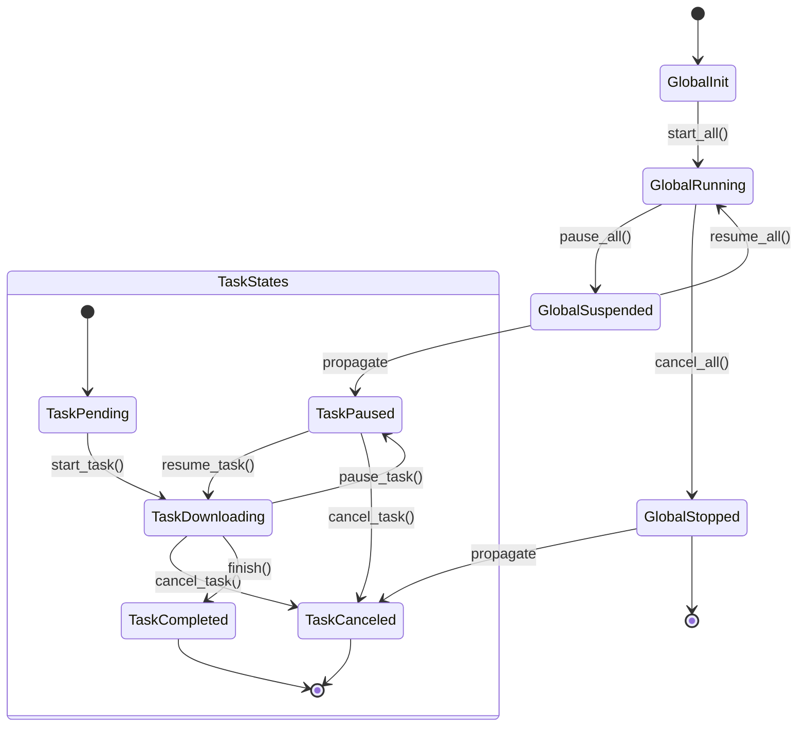

# Flow Control

`vielpork` provides a complete flow control method to make it easier for you to control the flow when writing asynchronous code.

- Global control
  - `downloader.lock().await.start(resources).await?;`
  - `downloader.lock().await.pause().await?;`
  - `downloader.lock().await.resume().await?;`
  - `downloader.lock().await.cancel().await?;`

- Task control
  - `downloader.lock().await.pause_task(resource).await?;`
  - `downloader.lock().await.resume_task(resource).await?;`
  - `downloader.lock().await.cancel_task(resource).await?;`

Just use it directly in the code, and `vielpork` will automatically handle the state transitions of the tasks.

## State Transition Diagram



## Reasonable State Transition

`vielpork`'s state transition is in the form of a finite state machine, with each task having a state, and each task's state transition is finite. This ensures that the task's state transition is reasonable and that unreasonable state transitions do not occur.

### Reasonable Global State Transition

```rust
let valid = match (*current, new_state) {
    (DownloaderState::Idle, DownloaderState::Running) => true,
    (DownloaderState::Running, DownloaderState::Suspended) => true,
    (DownloaderState::Suspended, DownloaderState::Running) => true,
    (DownloaderState::Running, DownloaderState::Stopped) => true,
    (DownloaderState::Suspended, DownloaderState::Stopped) => true,
    _ => false,
};
```

### Reasonable Task State Transition

```rust
let valid = match (*current, new_state) {
    (TaskState::Pending, TaskState::Paused) => true,
    (TaskState::Paused, TaskState::Pending) => true,
    (TaskState::Paused, TaskState::Paused) => true,
    (TaskState::Pending, TaskState::Downloading) => true,
    (TaskState::Downloading, TaskState::Paused) => true,
    (TaskState::Paused, TaskState::Downloading) => true,
    (TaskState::Downloading, TaskState::Completed) => true,
    (TaskState::Downloading, TaskState::Failed) => true,
    (TaskState::Failed,_) => true,
    (_, TaskState::Canceled) => true,
    _ => false,
};
```
