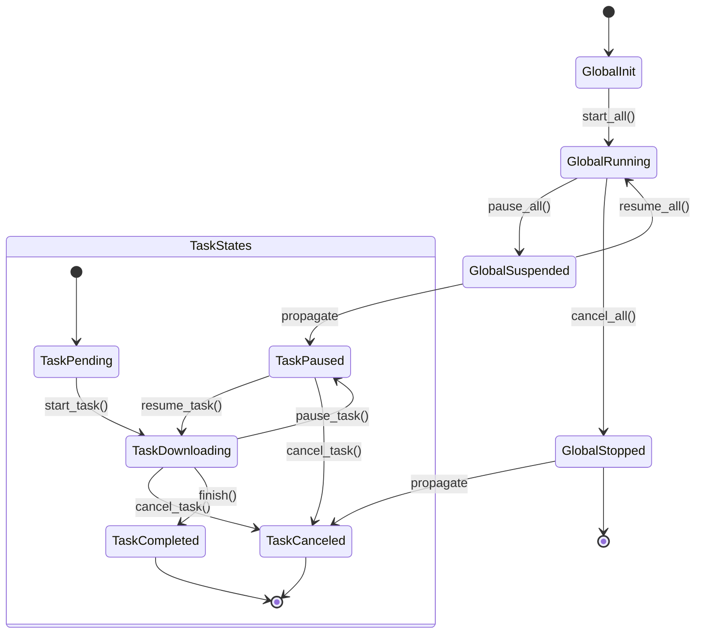

# Introduction

**Vielpork** is a Rust-powered HTTP downloader designed for performance and extensibility. It offers:

- 🚀 Multi-threaded downloads for maximum speed
- 📊 Multiple built-in reporters to adapt to most scenarios
- 📦 Rich path policy options and template naming support
- 🔧 Customizable resource resolution strategies for different download scenarios
- ⏯️ Support for pausing/resuming both global and individual tasks

## Related Projects

- [osynic_downloader](https://github.com/osynicite/osynic_downloader): A osu beatmapsets downloader lib & TUI application based on vielpork.

## Core Capabilities

- **Multi-threaded Architecture**: Leverage Rust's async runtime for concurrent chunk downloads
- **Extensible Reporting**:
  - Built-in reporters: TUI progress bar, CLI broadcast mpsc channel
  - Custom reporter implementation via trait
- **Smart Resolution**:
  - Custom resolution logic through Resolver trait
- **Recovery & Resilience**:
  - Resume interrupted downloads
- **Progress Tracking**:
  - Real-time speed calculations
  - ETA estimation
  - Detailed transfer statistics

## Built-in Options

### Reporters

- **TuiReporter**: A terminal-based progress bar based on the `indicatif` library
- **CliReporterBoardcastMpsc**: A reporter that broadcasts progress updates to multiple channels and finalizes them with a single channel ( Usage Example: In Tonic gRPC server streaming, the rx type can only be mpsc, so we need to broadcast the progress to a mpsc channel, then send it to the client through the server)

### Resolvers

- **UrlResolver**: A resolver that downloads resources from a URL, just a simple wrapper around reqwest

## Custom Components

You can see all traits at `vielpork::base::traits` and implement your own components.

### Custom Reporter

- Here are 2 traits that you need to implement with async_trait:
  - `ProgressReporter`: A trait that allows the reporter to handle progress updates
  - `ResultReporter`: A trait that allows the reporter to handle the results of operations or tasks

### Custom Resolver

- Here is only 1 trait that you need to implement with async_trait:
  - `ResourceResolver`: A trait that allows the resolver to download resources from a specific source

## Afterword (or the prologue)

I found the word "viel" and then thought about "rufen", "ekstase", "reichen".

But when I was still hesitating, a good friend came to my dorm and brought me a cup of smoked pork shreds.

So I named it "vielpork", which means a lot of pork shreds.

But in terms of functionality, this downloader is mainly about multi-reporting channel downloads, so it's also a lot of reporting.

"report" is very close to "vielpork", which is also good.

For me, who has been eating free porridge for a week, this name is already very good.

Oh, by the way, spicy boiled pork slices can also be called VielPork. I love it.
